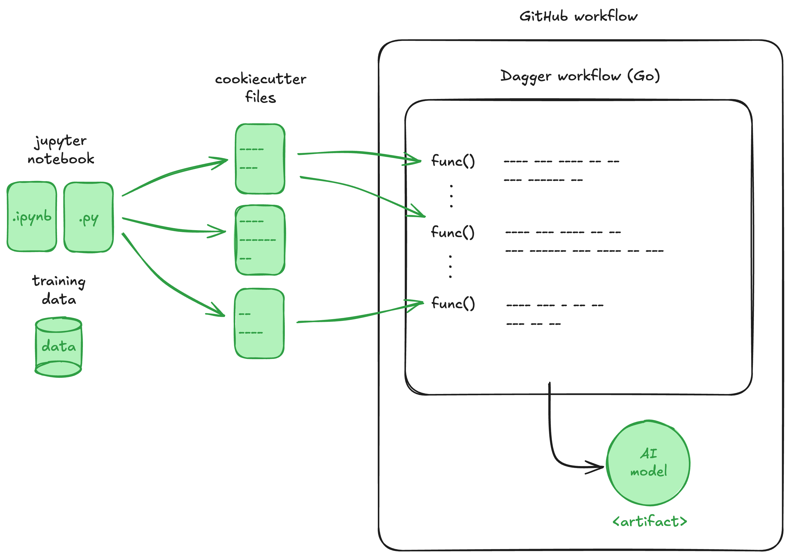

# ITU BDS SDSE'24 - Project

This project is part of the Software Development and Software Engineering course at ITU. The original project description can be found [here](https://github.com/lasselundstenjensen/itu-sdse-project).

In this project we were tasked with restructuring a Python monolith using the concepts we have learned throughout the course. This project contains a [Dagger workflow](https://github.com/PLtier/github-dagger-workflow-project/blob/main/pipeline.go) and a [GitHub workflow](https://github.com/PLtier/github-dagger-workflow-project/blob/main/.github/workflows/test_action.yml).



## Project Structure

```
├── README.md                        <- Project description and how to run the code
│
├── .github/workflows                <- GitHub Action workflows
│   │
│   ├── tag_version.yml              <- Workflow for creating version tags
│   │
│   └── log_and_test_action.yml      <- Workflow that automatically trains and tests model
│
├── pipeline_deps
│   │
│   └── requirements.txt             <- Dependencies for the pipeline
│
├── CODEOWNERS                       <- Defines codeowners for the repository
│
├── go.mod                           <- Go file that defines the module and required dependencies
│
├── go.sum                           <- Go file that ensures continuity and integrity of dependencies
│
├── pipeline.go                      <- Dagger workflow written in Go
│
├── pyproject.toml                   <- Configuration file
│
├── .pre-commit-config.yaml          <- Checks quality of code before commits
│
├── Makefile.venv                    <- Creates and manages Python virtual environment
│
├── references                       <- Documentation and extra resources
│
├── requirements.txt                 <- Python dependencies need for the project
│
├── tests
│   │
│   └── verify_artifacts.py          <- Tests to check if all artifacts are copied correctly
│
└── github_dagger_workflow_project   <- Source code for the project
    │
    ├── __init__.py                  <- Marks the directory as a Python package
    │
    ├── 01_data_transformations.py   <- Script for data preprocessing and transformation
    │
    ├── 02_model_training.py         <- Script for training the models
    │
    ├── 03_model_selection.py        <- Script for selecting the best perfoming model
    │
    ├── 04_prod_model.py             <- Script for comparing new best model and production model
    │
    ├── 05_model_deployment.py       <- Script for deploying model
    │
    ├── artifacts
    │   │
    │   └── raw_data.csv.dvc         <- Metadata tracked by DVC for data file
    │
    └── utils.py                     <- Helper functions
```

# How to run the code

## Artifact creation

The workflow can be triggered either on pull requests to `main` or manually.

It can be triggered manually [here](https://github.com/PLtier/github-dagger-workflow-project/actions/workflows/test_action.yml) by pressing `Run workflow` on the `main` branch, then refresh the page and the triggered workflow will appear. After all the jobs have been run, the model artifact can be found on the summary page of the run of the first job. We also store other artifacts for convenience.
The testing is automatically run afterwards to let the user check if it was of a quality.
Artifacts are stored for 90 days.

## Local development / Running

### Environment installation

For local running you need:

- `docker`
- `dagger` >= 15

For local development you need as well:

- `go` - 1.23.3 is currently used.
- `git`
- `python` >=3.11.9
- `make`

Then run:

```shell
make setup
.venv\Scripts\activate # for windows
source .venv/bin/activate # for linux/macos
```

Additionally, It installs `pre-commit` which takes care of formatting and linting before commits for go and python.

### Running the code:

#### Run scripts on the host machine

For that you can run scripts sequentially in the github_dagger_workflow_project.

> Beware: all artifacts will be appended to your repo dir!

#### Run in a container

The command will run the `dagger` pipeline. In the end, **only** final artifacts will be appended to

```shell
make container_run
```

#### Local testing

Perhaps most useful. It will not append any of the container-produced files to the host machine, but it will run a test script **which will ensure that all important artifacts are indeed logged**

```shell
make test
```

> Beware: it will not test the model on the inference test!

## Inference testing

The same workflow which generates artifacts automatically runs the inference testing. Also, the artifacts testing and the inference test is carried out after every PR (and subsequent commits) to `main`

## Maintaining code quality

- We used `pre-commit` to lint and format, as stated above. We use `ruff`, `ruff format`, `gofmt` and `govet`. We check for PEP8 warnings and errors.
- `main` branch-protection (with github repo settings)
  - PR is required before merging
  - at least one approval is needed. We automatically assign reviewers with `CODEOWNERS` file.
  - we required status checks to be passed for both of our jobs i.e. `Train and Upload Model` and `Unit Test Model Artifacts`. The test checks explicitly whether all artifacts have been generated and if the model passes inference test. Jobs are automatically triggered on merge.
- We maintained a clear goals via `Issues` and often quite verbose reviews.
- we used 90% of time semantic commits

## Code releases

On every push to main a new tag is released with the current time it was published.
See current tags: [Tags](https://github.com/PLtier/github-dagger-workflow-project/tags)

# Code decisions and reflections

> This is not the part of the documentation: you can read about a few (hard) decisions we have made on [Reflections](./references/project_reflections.md)
